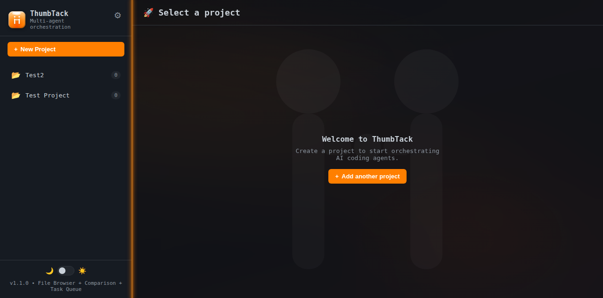
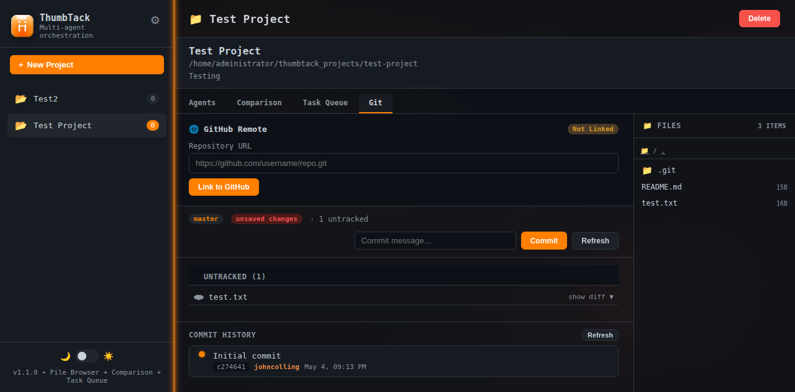

# ThumbTack — Agent Orchestrator

A dark-themed, single-page web application for spawning and orchestrating AI coding agents. Built with **FastAPI**, **Jinja2**, **SQLite**, and **asyncio subprocesses**.

---

## Screenshots

### Dashboard — Project Browser & Agent Spawner



### Git Integration — Commit History & Repository Status



---

## Features

- **Project Management** — Create and manage multiple agent projects with dedicated working directories
- **File Browser** — Navigate project files directly in the sidebar
- **Git Integration** — Full git workflow: init, commit, diff, status, and visual commit history
- **GitHub Remote Linking** — Connect projects to GitHub repos with PAT authentication
- **Task Queue** — Track background agent tasks and their status
- **Comparison Mode** — Side-by-side diff panels for reviewing agent outputs
- **Dark Theme** — Polished dark UI with orange (`#ff7f00`) accents and neon sidebar glow
- **Real-time Updates** — WebSocket streaming for live agent output

---

## Tech Stack

| Layer | Technology |
|-------|------------|
| Backend | FastAPI + Uvicorn |
| Frontend | Jinja2 + Vanilla JS + CSS Variables |
| Database | SQLite (async aiosqlite) |
| Agent Runner | asyncio subprocesses |
| Styling | Custom dark theme, glass effects, CSS variables |

---

## Quick Start

```bash
# Clone
git clone https://github.com/johncolling/thumbtack.git
cd thumbtack

# Install dependencies
python -m venv venv
venv/bin/pip install -r requirements.txt

# Run
python -m uvicorn main:app --host 0.0.0.0 --port 3456
```

Then open `http://localhost:3456` (or your machine's IP) in your browser.

---

## Configuration

Create a `.env` file in the project root:

```env
OPENAI_API_KEY=sk-...
GITHUB_PAT=ghp_...
```

---

## License

MIT — see [LICENSE](LICENSE) for details.
